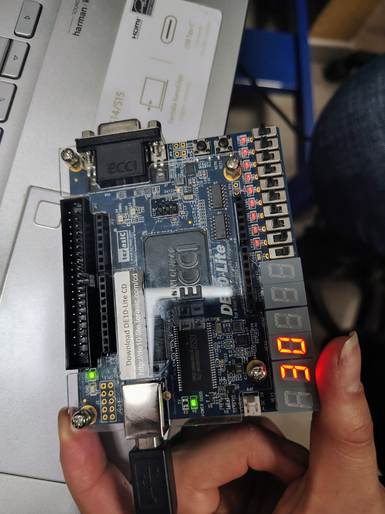
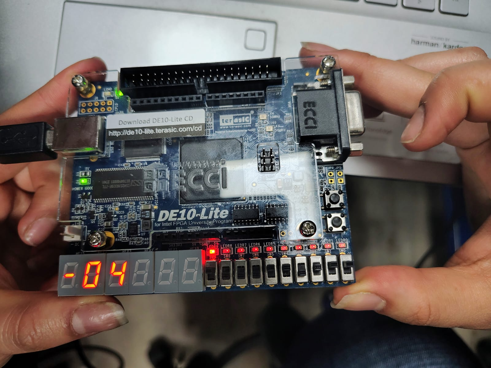
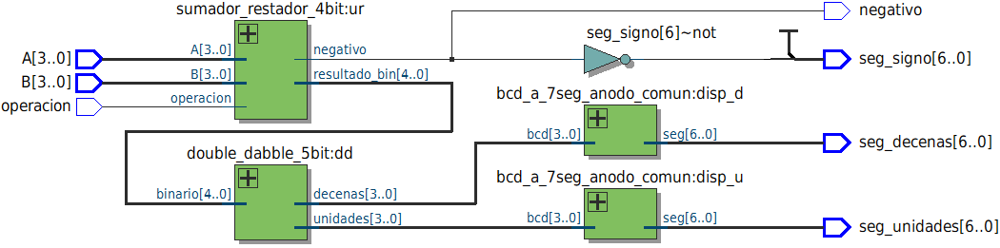

# Lab02: Decodificador BCD a 7 segmentos

# Integrantes
* [Paula Andrea Cortéz](https://github.com/Cortes271) 
* [Santiago Leonardo Molina Bogotá](https://github.com/SaintGao-cmd)
* [Andrés Felipe Muñoz Martinez](https://github.com/Andresfmm2007) 
* [Laura Ximena Rojas Pachon](https://github.com/LauXRS) 

# Informe

Índice:

1. [Documentación del diseño implementado](#documentación-del-diseño-implementado)
2. [Simulaciones](#simulaciones)
3. [Evidencias de implementación](#evidencias-de-implementación)
4. [Conclusiones](#conclusiones)
5. [Referencias](#referencias)

## Documentación del diseño implementado

# Informe de Diseño: Sumador/Restador de 4 bits con Salida en Display de 7 Segmentos

## Índice
1. [Módulo `sumador_restador_4bit`](#1-módulo-sumador_restador_4bit)
2. [Módulo `dd_stage_2d`](#2-módulo-dd_stage_2d)
3. [Módulo `double_dabble_5bit`](#3-módulo-double_dabble_5bit)
4. [Módulo `bcd_a_7seg_anodo_comun`](#4-módulo-bcd_a_7seg_anodo_comun)
5. [Módulo top `sumDD`](#5-módulo-top-sumdd)
---

## 1. Módulo `sumador_restador_4bit`

### 1.1 Descripción
Este módulo se encarga de realizar la parte aritmética del sistema. Recibe dos números de 4 bits (A y B) y, mediante la señal operacion, permite seleccionar entre suma y resta.

El resultado se entrega como una magnitud positiva de 5 bits, mientras que la señal negativo indica si una resta produjo un resultado menor que cero. De esta manera, los módulos encargados de convertir y mostrar el resultado no necesitan trabajar directamente con números negativos.

### 1.2 Declaración del Módulo y Puertos
```verilog
module sumador_restador_4bit (
    input  wire [3:0] A,
    input  wire [3:0] B,
    input  wire       operacion,      // 0 = suma, 1 = resta
    output wire [4:0] resultado_bin,  // magnitud (0-30 para suma, 0-15 para resta)
    output wire       negativo
);
```
- `A`, `B`: operandos de 4 bits (0 a 15).
- `operacion`: selecciona el modo (0 = suma, 1 = resta).
- `resultado_bin`: magnitud del resultado, en 5 bits para que quepa hasta el 30 (15+15).
- `negativo`: se activa solo si estás restando y el resultado real era negativo.

### 1.3 Cables Internos
```verilog
wire [4:0] suma;        // resultado de A + B, sin signo, hasta 30
wire [4:0] resta;       // resultado de A - B en complemento a 2 (5 bits)
wire resta_es_neg;      // bit de signo del resultado de la resta
wire [4:0] resta_mag;   // magnitud absoluta de la resta
```

### 1.4 Lógica
```verilog
wire [4:0] suma  = A + B;
wire [4:0] resta = {1'b0, A} - {1'b0, B};
wire resta_es_neg = resta[4];
wire [4:0] resta_mag = resta_es_neg ? (~resta + 5'd1) : resta;
assign resultado_bin = operacion ? resta_mag : suma;
assign negativo      = operacion & resta_es_neg;
```
**Explicación:**
A y B: números de entrada de 4 bits, con valores entre 0 y 15.
operacion: selecciona suma (0) o resta (1).
resultado_bin: resultado de la operación en 5 bits.
negativo: indica si la resta dio un resultado negativo.

### 1.5 Tabla de Verdad (casos representativos)
| A | B | operacion | resultado_bin | negativo | Interpretación |
|---|---|---|---|---|---|
| 5 | 3 | 0 (suma) | 8 | 0 | 5 + 3 = 8 |
| 15 | 15 | 0 (suma) | 30 | 0 | 15 + 15 = 30 (máximo posible) |
| 9 | 5 | 1 (resta) | 4 | 0 | 9 − 5 = 4 |
| 5 | 9 | 1 (resta) | 4 | 1 | 5 − 9 = −4 (magnitud 4, signo negativo) |
| 0 | 0 | 1 (resta) | 0 | 0 | 0 − 0 = 0 |

---

## 2. Módulo `dd_stage_2d`

### 2.1 Descripción
Este módulo representa una etapa del algoritmo Double Dabble, también conocido como "desplazar y sumar 3". Su función es ayudar a convertir un número binario a formato BCD para poder mostrarlo posteriormente en los displays.

Cada etapa recibe las decenas y unidades en BCD, revisa si alguno de los dígitos es 5 o mayor, suma 3 cuando es necesario y después realiza un desplazamiento.

### 2.2 Declaración del Módulo y Puertos
```verilog
module dd_stage_2d (
    input  wire [7:0] bcd_in,      // {decenas, unidades}
    input  wire       bin_bit_in,
    output wire [7:0] bcd_out
);
```
- `bcd_in`: valor BCD acumulado hasta el momento (8 bits: 4 de decenas + 4 de unidades).
- `bin_bit_in`: el siguiente bit del número binario a convertir.
- `bcd_out`: valor BCD actualizado tras la corrección y el desplazamiento.

### 2.3 Cables Internos
```verilog
wire [3:0] u_corr;      // unidades corregidas (+3 si >= 5)
wire [3:0] d_corr;      // decenas corregidas (+3 si >= 5)
wire [7:0] corregido;   // {d_corr, u_corr} antes del desplazamiento
```

### 2.4 Lógica
```verilog
wire [3:0] u_corr = (bcd_in[3:0] >= 5) ? (bcd_in[3:0] + 4'd3) : bcd_in[3:0];
wire [3:0] d_corr = (bcd_in[7:4] >= 5) ? (bcd_in[7:4] + 4'd3) : bcd_in[7:4];
wire [7:0] corregido = {d_corr, u_corr};
assign bcd_out = {corregido[6:0], bin_bit_in};
```
**Explicación línea por línea:**
- `u_corr`: si el nibble de unidades es ≥ 5, se le suma 3 antes de desplazar. Esta es la corrección "+3" que evita que un dígito BCD sobrepase el valor 9 al desplazarse (el truco matemático central del algoritmo).
- `d_corr`: se aplica la misma corrección al nibble de decenas.
- `corregido = {d_corr, u_corr}`: se reagrupan ambos nibbles ya corregidos en un valor de 8 bits.
- `bcd_out = {corregido[6:0], bin_bit_in}`: se descarta el bit más significativo de `corregido` (ya no aporta información útil dentro de 2 dígitos) y se desplaza todo un bit a la izquierda, insertando el nuevo bit binario en la posición menos significativa.

### 2.5 Tabla de Verdad (ejemplo de corrección de un nibble)
| bcd_in (nibble) | ¿>= 5? | nibble corregido |
|---|---|---|
| 0000 (0) | No | 0000 (0) |
| 0100 (4) | No | 0100 (4) |
| 0101 (5) | Sí | 1000 (8) |
| 1001 (9) | Sí | 1100 (12) |

**Ejemplo de desplazamiento completo** (`bcd_in = 8'b00000101`, `bin_bit_in = 1`):

| Señal | Valor |
|---|---|
| bcd_in | 0000 0101 |
| u_corr | 1000 |
| d_corr | 0000 |
| corregido | 0000 1000 |
| bcd_out | 0001 0001 |

### 2.6 Limitaciones
- Asume que `bcd_in` ya llega en formato BCD válido (cada nibble entre 0 y 9); no corrige nibbles fuera de ese rango.
- Es puramente combinacional: por sí sola no convierte nada, necesita estar encadenada con otras etapas iguales (ver siguiente módulo).

---

## 3. Módulo `double_dabble_5bit`

### 3.1 Descripción
Este módulo convierte el resultado binario de 5 bits, que puede estar entre 0 y 30, en dos dígitos BCD: decenas y unidades.

Su funcionamiento es estructural, ya que utiliza cinco instancias de dd_stage_2d, una por cada bit del número binario.

### 3.2 Entradas y Salidas
| Señal | Tipo | Descripción |
|---|---|---|
| `binario` | input [4:0] | Número binario a convertir (0 a 30) |
| `decenas` | output [3:0] | Dígito BCD de las decenas |
| `unidades` | output [3:0] | Dígito BCD de las unidades |

### 3.3 Funcionamiento
```verilog
module double_dabble_5bit (
    input  wire [4:0] binario,
    output wire [3:0] decenas,
    output wire [3:0] unidades
);
    wire [7:0] bcd0, bcd1, bcd2, bcd3, bcd4, bcd5;
    assign bcd0 = 8'd0;
    dd_stage_2d s0 (.bcd_in(bcd0), .bin_bit_in(binario[4]), .bcd_out(bcd1));
    dd_stage_2d s1 (.bcd_in(bcd1), .bin_bit_in(binario[3]), .bcd_out(bcd2));
    dd_stage_2d s2 (.bcd_in(bcd2), .bin_bit_in(binario[2]), .bcd_out(bcd3));
    dd_stage_2d s3 (.bcd_in(bcd3), .bin_bit_in(binario[1]), .bcd_out(bcd4));
    dd_stage_2d s4 (.bcd_in(bcd4), .bin_bit_in(binario[0]), .bcd_out(bcd5));
    assign decenas  = bcd5[7:4];
    assign unidades = bcd5[3:0];
endmodule
```
El proceso ocurre así:
1. Se inicializa el acumulador BCD (`bcd0`) en cero.
2. La instancia `s0` procesa el bit más significativo (`binario[4]`), aplicando corrección y desplazamiento, y produce `bcd1`.
3. Cada etapa siguiente (`s1` a `s4`) toma el resultado de la anterior y procesa el siguiente bit, en orden descendente (`binario[3]`, `binario[2]`, `binario[1]`, `binario[0]`).
4. Al terminar la última etapa (`s4`), `bcd5` contiene el número ya convertido: los 4 bits altos son las decenas y los 4 bits bajos son las unidades.

**Ejemplo:** para `binario = 5'd25` (11001), el resultado esperado es `decenas = 2`, `unidades = 5`.

---

## 4. Módulo `bcd_a_7seg_anodo_comun`

### 4.1 Descripción
Convierte un dígito BCD (0 a 9) en el patrón de segmentos necesario para encenderlo en un display de 7 segmentos de **ánodo común**, donde cada segmento se enciende con un nivel lógico **bajo** (0), no con un 1.

### 4.2 Declaración del Módulo y Puertos
```verilog
module bcd_a_7seg_anodo_comun (
    input  wire [3:0] bcd,
    output reg  [6:0] seg  // seg = {g,f,e,d,c,b,a}
);
```
- `bcd`: dígito de entrada (0 a 9; valores 10-15 apagan el display).
- `seg`: salida de 7 bits, uno por cada segmento del display, ordenados como `{g,f,e,d,c,b,a}`.

### 4.3 Cables Internos
Este módulo no tiene cables internos adicionales; toda la lógica se resuelve directamente sobre la salida `seg` mediante un bloque combinacional (`always @(*)`).

### 4.4 Lógica
```verilog
always @(*) begin
    case (bcd)
        4'd0: seg = 7'b1000000;
        4'd1: seg = 7'b1111001;
        4'd2: seg = 7'b0100100;
        4'd3: seg = 7'b0110000;
        4'd4: seg = 7'b0011001;
        4'd5: seg = 7'b0010010;
        4'd6: seg = 7'b0000010;
        4'd7: seg = 7'b1111000;
        4'd8: seg = 7'b0000000;
        4'd9: seg = 7'b0010000;
        default: seg = 7'b1111111;
    endcase
end
```
Es una tabla de búsqueda (`case`) sensible a cualquier cambio en `bcd` (bloque combinacional). Cada patrón de bits enciende los segmentos necesarios para dibujar el dígito correspondiente; por ejemplo, para el 0 se encienden todos los segmentos excepto el central (`g`). El caso `default` apaga todos los segmentos (todos en 1) si `bcd` recibe un valor fuera de 0-9.

### 4.5 Tabla de Verdad
| bcd | seg [g f e d c b a] | Dígito mostrado |
|---|---|---|
| 0000 (0) | 1000000 | 0 |
| 0001 (1) | 1111001 | 1 |
| 0010 (2) | 0100100 | 2 |
| 0011 (3) | 0110000 | 3 |
| 0100 (4) | 0011001 | 4 |
| 0101 (5) | 0010010 | 5 |
| 0110 (6) | 0000010 | 6 |
| 0111 (7) | 1111000 | 7 |
| 1000 (8) | 0000000 | 8 |
| 1001 (9) | 0010000 | 9 |
| otro | 1111111 | display apagado |


---

## 5. Módulo top `sumDD`

### 5.1 Descripción
Es el módulo de nivel superior (top-level) que integra todo el sistema: toma las entradas `A`, `B` y `operacion`, calcula el resultado aritmético, lo convierte a BCD y finalmente genera los patrones de 7 segmentos necesarios para mostrar el resultado en tres displays: decenas, unidades y signo.

### 5.2 Entradas y Salidas
| Señal | Tipo | Descripción |
|---|---|---|
| `A` | input [3:0] | Primer operando (0-15) |
| `B` | input [3:0] | Segundo operando (0-15) |
| `operacion` | input | 0 = suma, 1 = resta |
| `seg_decenas` | output [6:0] | Segmentos del display de decenas |
| `seg_unidades` | output [6:0] | Segmentos del display de unidades |
| `seg_signo` | output [6:0] | Segmentos del display de signo (solo usa el segmento "g") |
| `negativo` | output | Indica si el resultado de la resta fue negativo |

### 5.3 Funcionamiento
```verilog
module sumDD (
    input  wire [3:0] A,
    input  wire [3:0] B,
    input  wire       operacion,       // 0 = suma, 1 = resta
    output wire [6:0] seg_decenas,
    output wire [6:0] seg_unidades,
    output wire [6:0] seg_signo,       // display extra para el signo "-"
    output wire       negativo
);
    wire [4:0] resultado_bin;
    sumador_restador_4bit ur (
        .A(A),
        .B(B),
        .operacion(operacion),
        .resultado_bin(resultado_bin),
        .negativo(negativo)
    );
    wire [3:0] decenas, unidades;
    double_dabble_5bit dd (
        .binario  (resultado_bin),
        .decenas  (decenas),
        .unidades (unidades)
    );
    bcd_a_7seg_anodo_comun disp_d (.bcd(decenas),  .seg(seg_decenas));
    bcd_a_7seg_anodo_comun disp_u (.bcd(unidades), .seg(seg_unidades));
    // Signo: solo segmento "g" encendido = "-" ; apagado si es positivo
    assign seg_signo = negativo ? 7'b0111111 : 7'b1111111;
endmodule
```

El módulo conecta en cascada las etapas ya descritas:

1. **Cálculo aritmético:** la instancia `ur` de `sumador_restador_4bit` recibe `A`, `B` y `operacion`, y produce `resultado_bin` (magnitud en 5 bits) y `negativo`.
2. **Conversión a BCD:** la instancia `dd` de `double_dabble_5bit` convierte `resultado_bin` en dos dígitos BCD: `decenas` y `unidades`.
3. **Despliegue en 7 segmentos:** dos instancias de `bcd_a_7seg_anodo_comun` (`disp_d` y `disp_u`) convierten cada dígito BCD en su patrón de segmentos correspondiente.
4. **Indicador de signo:** la línea `assign seg_signo = negativo ? 7'b0111111 : 7'b1111111;` controla un tercer display que enciende únicamente el segmento "g" (guion central) cuando `negativo = 1`, formando el símbolo "−"; si el resultado es positivo, todos los segmentos se apagan (display en blanco).

**Ejemplo de comportamiento completo:**

| operacion | A | B | resultado_bin | decenas | unidades | negativo | Display final |
|---|---|---|---|---|---|---|---|
| 0 | 7 | 8 | 15 | 1 | 5 | 0 | " 15" |
| 1 | 5 | 9 | 4 | 0 | 4 | 1 | "−04" |
| 1 | 9 | 5 | 4 | 0 | 4 | 0 | " 04" |

---

#### 3.3 Funcionamiento

#### 3.4 Implementación


*Figura 1. Adición 15+15 FPGA*


*Figura 2. Sustracción 3-7 FPGA*

### 4. Diagramas

Figura 3. Diagrama esquematico RTL de descripción de hardware dado por Quartus 

## Simulaciones

### 1. Simulación de [Módulo 1]

#### 1.1 Inclusión de Archivos y Timescale

```
```

#### 1.2 Declaración del Módulo y Señales

```verilog
// [Código]
```

#### 1.3 Instancia del DUT

```verilog
// [Código]
```

#### 1.4 Volcado de Formas de Onda

```verilog
// [Código]
```

#### 1.5 Proceso Principal de Pruebas

```verilog
// [Código]
```

#### 1.6 Modelo de Referencia

#### 1.7 Salida Esperada en Consola

```text
[Salida esperada]
```

#### 1.8 Resultados

### 2. Simulación de [Módulo 2]

#### 2.1 Inclusión de Archivos y Timescale

```verilog
`include "[archivo].v"
`timescale [unidad]/[precisión]
```

#### 2.2 Declaración de Señales y Variables

| Señal / Variable | Tipo | Descripción |
| :--- | :--- | :--- |
|  |  |  |

#### 2.3 Instancia del DUT

```verilog
// [Código]
```

#### 2.4 Volcado VCD

```verilog
// [Código]
```

#### 2.5 Proceso Principal de Pruebas

```verilog
// [Código]
```

#### 2.6 Salida Esperada en Consola

```text
[Salida esperada]
```

#### 2.7 Diagramas de Simulación


*Figura 2. [Descripción de la gráfica.]*

### 3. Simulación de [Módulo 3]

#### 3.1 Verificación mediante Testbench

#### 3.2 Resultado de la Simulación

```text
[Salida obtenida]
```

#### 3.3 Posibles Errores y Depuración

```text
[Errores comunes]
```

#### 3.4 Diagramas


## Conclusiones
- El algoritmo Double Dabble demostró ser una solución eficiente para la conversión binario-BCD sin necesidad de usar divisiones ni módulos aritméticos complejos, apoyándose únicamente en desplazamientos y sumas condicionales.
- El uso del operador ternario (?:) en lugar de if evidenció que en Verilog, a diferencia de un lenguaje de software, las condiciones no representan "bifurcaciones de control" sino multiplexores de hardware, es decir, ambos caminos existen físicamente y solo se selecciona cuál valor pasa.
- Escalar el diseño de 8 bits a 4 y 5 bits permitió comprobar que el número de etapas del Double Dabble depende directamente del ancho del dato de entrada (N etapas para N bits), y que el ancho del registro BCD debe dimensionarse según la cantidad máxima de dígitos decimales que el resultado pueda alcanzar.
- Separar la lógica de cálculo (negativo como señal booleana) de la lógica de visualización (seg_signo como patrón de segmentos) permitió identificar una buena práctica de diseño: mantener las señales de control/lógica independientes de sus representaciones visuales, facilitando la reutilización del módulo en otros contextos (LEDs, lógica de decisión, etc.) sin depender del hardware de salida específico.
- La modularidad del diseño (separar el conversor Double Dabble, el decodificador de 7 segmentos y el sumador/restador en bloques independientes) facilitó la depuración, la reutilización de código entre distintos anchos de bits (4, 5 y 8 bits), y la escalabilidad del proyecto hacia implementaciones más complejas.

## Referencias
## Bibliografía

* Ramirez, Jhon (2026). Lab02: Decodificador BCD a 7 segmentos. <https://github.com/digital-ECCI/Arquitetura_de_procesadores-ECCI-2026-II/tree/main/labs/02_lab02>
* 
