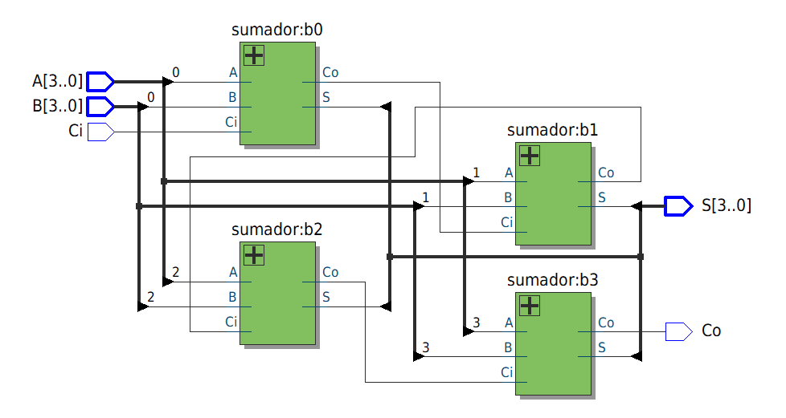
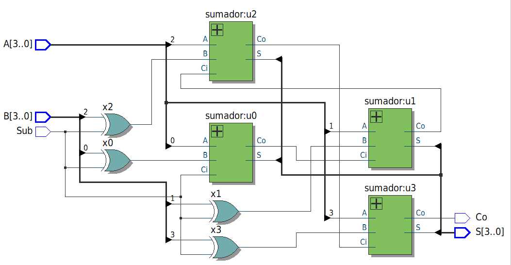
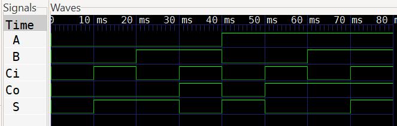
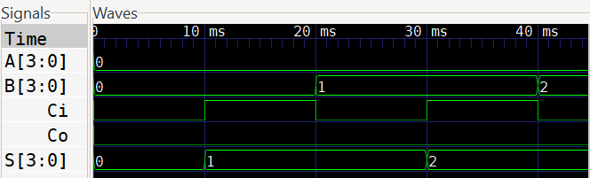
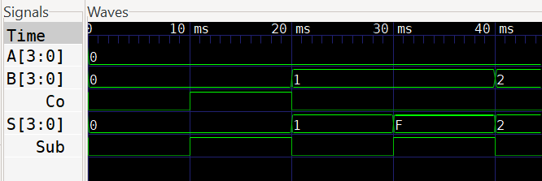

        
# Lab01 - Sumador/Restador de 4 bits

# Integrantes
* [Paula Andrea Cortéz](https://github.com/Cortes271) 
* [Santiago Leonardo Molina Bogotá](https://github.com/SaintGao-cmd)
* [Andrés Felipe Muñoz Martinez](https://github.com/Andresfmm2007) 
* [Laura Ximena Rojas Pachon](https://github.com/LauXRS) 
# Informe

Indice:

1. [Documentación](#documentación-de-los-circuitos-implementados-implementado)
2. [Simulaciones](#simulaciones)
3. [Evidencias de implementación](#evidencias-de-implementación)
4. [Preguntas](#preguntas)
5. [Conclusiones](#conclusiones)
6. [Referencias](#referencias)

## Documentación del diseño implementado

### 1. Sumador 1 bit
####

#### 1.1 Descripción

Este módulo implementa un sumador completo de 1 bit de forma **estructural**, es decir, describiendo explícitamente las compuertas y sus conexiones. Es la base para construir sumadores de mayor ancho de bits (como sumadores de 4 u 8 bits) conectando varios de estos módulos en cascada.

#### 1.2 Declaración del Módulo y Puertos

```verilog
module sumador(
    input A,
    input B,
    input Ci,
    output S,
    output Co
);
```

- **`A`** y **`B`**: Son los dos bits de entrada que se van a sumar.
- **`Ci`** (Carry-in): Es el acarreo de entrada, proveniente de una suma anterior.
- **`S`** (Suma): Es el bit resultante de la suma.
- **`Co`** (Carry-out): Es el acarreo de salida que se genera al sumar.

#### 1.3 Cables Internos

```verilog
wire xor_ab;
wire and_ab;
wire and_b_ci;
wire and_a_ci;
wire or_w1;
```

Se declaran 5 cables (`wire`) para conectar las salidas de unas compuertas con las entradas de otras. No almacenan valor, solo transmiten señales.

| Cable | Función |
| :--- | :--- |
| `xor_ab` | Resultado de A XOR B |
| `and_ab` | Resultado de A AND B |
| `and_b_ci` | Resultado de B AND Ci |
| `and_a_ci` | Resultado de A AND Ci |
| `or_w1` | Resultado de (A AND B) OR (B AND Ci) |

#### 1.4 Lógica de la Suma (`S`)

```verilog
xor u1(xor_ab, A, B);        // XOR de A y B
xor u2(S, xor_ab, Ci);       // XOR del resultado anterior con Ci
```

La fórmula booleana para la suma es:

> **S = A ⊕ B ⊕ Ci**

Primero se calcula `xor_ab = A ⊕ B`.  
Luego, ese resultado se vuelve a aplicar XOR con `Ci` para obtener la salida `S`.

#### 1.5 Lógica del Acarreo de Salida (`Co`)

```verilog
and u3(and_ab, A, B);        // A AND B
and u4(and_b_ci, B, Ci);     // B AND Ci
and u5(and_a_ci, A, Ci);     // A AND Ci

or  u6(or_w1, and_ab, and_b_ci); // (A&B) OR (B&Ci)
or  u7(Co, or_w1, and_a_ci);     // Resultado final de Co
```

La fórmula booleana para el acarreo de salida es:

> **Co = (A · B) + (B · Ci) + (A · Ci)**

El código implementa esto en dos etapas:
1. Genera los tres productos (AND) por separado.
2. Los combina con compuertas OR para obtener la suma de productos final.

#### 1.6 Tabla de Verdad (Resumen)

| A | B | Ci | S | Co |
| :---: | :---: | :---: | :---: | :---: |
| 0 | 0 | 0 | 0 | 0 |
| 0 | 0 | 1 | 1 | 0 |
| 0 | 1 | 0 | 1 | 0 |
| 0 | 1 | 1 | 0 | 1 |
| 1 | 0 | 0 | 1 | 0 |
| 1 | 0 | 1 | 0 | 1 |
| 1 | 1 | 0 | 0 | 1 |
| 1 | 1 | 1 | 1 | 1 |

### 2. Sumador 4 bits
####

#### 2.1 Descripción

Este código describe un **sumador de 4 bits** construido en **cascada** (Ripple Carry). Está formado por la conexión en serie de 4 módulos del sumador completo de 1 bit (`sumador`) que explicamos anteriormente.

#### 2.2 Declaración del Módulo y Puertos

```verilog
module sumador4b(
    input  [3:0] A,
    input  [3:0] B,
    input        Ci,      // acarreo de entrada inicial
    output [3:0] S,
    output       Co       // acarreo de salida final
);
```

- **`A`** y **`B`** (`[3:0]`): Son buses de 4 bits (A₀ a A₃ y B₀ a B₃) que representan los dos números que se van a sumar.
- **`Ci`**: Es el acarreo de entrada inicial (generalmente va conectado a 0 para sumas normales, o a 1 para restas en complemento a 2).
- **`S`** (`[3:0]`): Es el bus de 4 bits del resultado de la suma.
- **`Co`**: Es el acarreo de salida final, que indica si la suma de los 4 bits genera un desbordamiento (overflow).

#### 2.3 Cables Internos (Propagación del Acarreo)

```verilog
wire c1, c2, c3;
```

Se declaran 3 cables internos para conectar el acarreo de salida de cada sumador de 1 bit con la entrada del siguiente. 

- **`c1`**: Acarreo que sale del Bit 0 y entra al Bit 1.
- **`c2`**: Acarreo que sale del Bit 1 y entra al Bit 2.
- **`c3`**: Acarreo que sale del Bit 2 y entra al Bit 3.

#### 2.4 Instanciación de los 4 Módulos (Conexión en Cascada)

El módulo utiliza **instancias** (copias) del sumador de 1 bit llamado `sumador`. Cada instancia procesa un par de bits (Aₙ y Bₙ) junto con un acarreo de entrada, y genera su bit de suma (Sₙ) y un acarreo de salida.

```verilog
    // Bit 0 (menos significativo): usa el acarreo de entrada Ci
    sumador b0 (
        .A  (A[0]),
        .B  (B[0]),
        .Ci (Ci),
        .S  (S[0]),
        .Co (c1)
    );

    // Bit 1
    sumador b1 (
        .A  (A[1]),
        .B  (B[1]),
        .Ci (c1),
        .S  (S[1]),
        .Co (c2)
    );

    // Bit 2
    sumador b2 (
        .A  (A[2]),
        .B  (B[2]),
        .Ci (c2),
        .S  (S[2]),
        .Co (c3)
    );

    // Bit 3 (más significativo): genera el acarreo de salida final
    sumador b3 (
        .A  (A[3]),
        .B  (B[3]),
        .Ci (c3),
        .S  (S[3]),
        .Co (Co)
    );
```

#### 2.5 Flujo de la Suma (Ripple Carry)

El apodo "Ripple Carry" (acarreo en cadena o en ondulación) viene de que el acarreo debe "viajar" o "propagarse" desde el bit menos significativo (LSB) hasta el más significativo (MSB):

1. El **Bit 0** suma `A[0] + B[0] + Ci` y genera `c1`.
2. El **Bit 1** suma `A[1] + B[1] + c1` y genera `c2`.
3. El **Bit 2** suma `A[2] + B[2] + c2` y genera `c3`.
4. El **Bit 3** suma `A[3] + B[3] + c3` y genera el acarreo final `Co`.

#### 2.6 Ejemplo Práctico

Si queremos sumar `A = 0101` (5) y `B = 0011` (3) con `Ci = 0`:

| Bit | Aₙ | Bₙ | Ci (entra) | Sₙ (resultado) | Co (sale) |
| :---: | :---: | :---: | :---: | :---: | :---: |
| b0 | 1 | 1 | 0 | 0 | 1 (`c1`) |
| b1 | 0 | 1 | 1 | 0 | 1 (`c2`) |
| b2 | 1 | 0 | 1 | 0 | 1 (`c3`) |
| b3 | 0 | 0 | 1 | 1 | 0 (`Co`) |

Resultado final: `S = 1000` (8) y `Co = 0`. ¡La suma de 5 + 3 = 8 es correcta!

> **Limitación:** Este sumador es funcional, pero su velocidad de operación está limitada porque el acarreo debe propagarse a través de los 4 sumadores secuencialmente. Para números de muchos bits, se usan sumadores con anticipación de acarreo (Carry-Lookahead) para ser más rápidos.

### 3. Sumador/Restador
#### 

#### 3.1 Descripción

Un sumador/restador de 4 bits es un circuito combinacional que ejecuta sumas y restas binarias optimizando espacio de hardware al reutilizar la misma arquitectura mediante la lógica del complemento a 2.  

#### Módulo Sumador/Restador de 4 bits

Este módulo implementa una suma o resta de dos números de 4 bits (A y B) dependiendo de la señal `Sub`.  
- Si `Sub = 0`, realiza `S = A + B`.  
- Si `Sub = 1`, realiza `S = A - B` (usando complemento a 2).  

## Entradas y salidas
| Señal | Tipo   | Descripción                          |
|-------|--------|--------------------------------------|
| A     | input  | Operando A (4 bits)                  |
| B     | input  | Operando B (4 bits)                  |
| Sub   | input  | Control: 0 suma, 1 resta             |
| S     | output | Resultado de la operación (4 bits)   |
| Co    | output | Acarreo de salida (bit más significativo) |

### Funcionamiento
Las puertas `XOR` condicionan cada bit de B con la señal Sub.
Si `Sub=1`, B se invierte (complemento a 1); el acarreo de entrada del primer sumador se fuerza a Sub, completando el complemento a 2.

Se instancian 4 sumadores de 1 bit (módulo sumador) en cascada para obtener el resultado.

#### 3.2 Diagramas

*Figura 1. RTL dado por software Quartus para el Sumador de 4 bits*

####

*Figura 2. RTL dado por software Quartus para el Sumador/Restador*
 
## Simulaciones 

### 3. Simulación del sumador/restador

#### 3.1 Verificación mediante Testbench

Para validar el correcto funcionamiento del módulo, se desarrolló un _testbench_ autoverificable que realiza un barrido exhaustivo de todas las combinaciones posibles de entradas.

El testbench realiza las siguientes comprobaciones:
- **Cobertura**: 16 valores para `A` × 16 valores para `B` × 2 valores para `Sub` = **512 casos de prueba**.
- **Cálculo esperado**: 
  - Para suma (`Sub=0`), calcula `A + B` en 5 bits.
  - Para resta (`Sub=1`), calcula `A + (~B) + 1` (complemento a 2) en 5 bits.
- **Salida**: Compara en cada caso la salida del DUT (`S` y `Co`) contra los valores esperados e informa si hay fallos.
- **Trazas**: Genera un archivo `sumadorRestador.vcd` para visualizar formas de onda en GTKWave.

#### Resultado de la simulación (esperado)
Al ejecutar este testbench en el simulador `Icarus Verilog`, la consola mostrará un resumen final indicando si todos los casos fueron exitosos. 

```
 > vvp sumadorRestador_tb.v.out 

VCD info: dumpfile sumadorRestador.vcd opened for output.
========================================================
 Simulacion exhaustiva: sumadorRestador (4 bits)
========================================================
 A    B    Sub  | S    Co   | S_esp    Co_esp   | OK? 
--------------------------------------------------------
--------------------------------------------------------
 RESULTADO: Todos los 512 casos pasaron correctamente.
========================================================
sumadorRestador_tb.v:89: $finish called at 5120 (1ms)
Execution finished with exit code 0
```

En caso de fallos, el testbench detalla exactamente qué combinación de entradas produjo un resultado incorrecto, facilitando la depuración.

```
> iverilog   -o build\sumadorRestador_tb.v.out sumadorRestador_tb.v 

./sumadorRestador.v:23: error: Unknown module type: sumador
./sumadorRestador.v:32: error: Unknown module type: sumador
./sumadorRestador.v:41: error: Unknown module type: sumador
./sumadorRestador.v:50: error: Unknown module type: sumador
5 error(s) during elaboration.
*** These modules were missing:
        sumador referenced 4 times.
***
Compilation finished with exit code 5
```

#### 3.2 Diagrama


*Figura 3. Gráfica simulación sumador de 1 bit*


*Figura 4. Gráfica simulación sumador de 4 bits*


*Figura 5. Gráfica simulación sumador/restador de 4 bits*

## Evidencias de implementación


## Conclusiones


## Referencias

